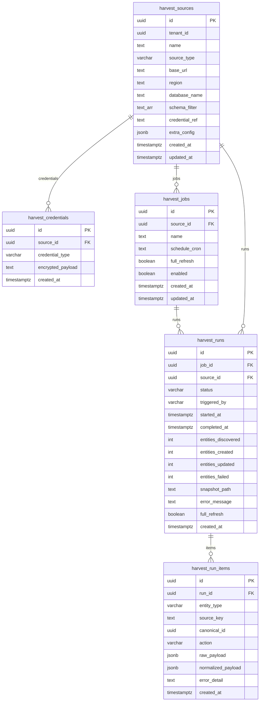
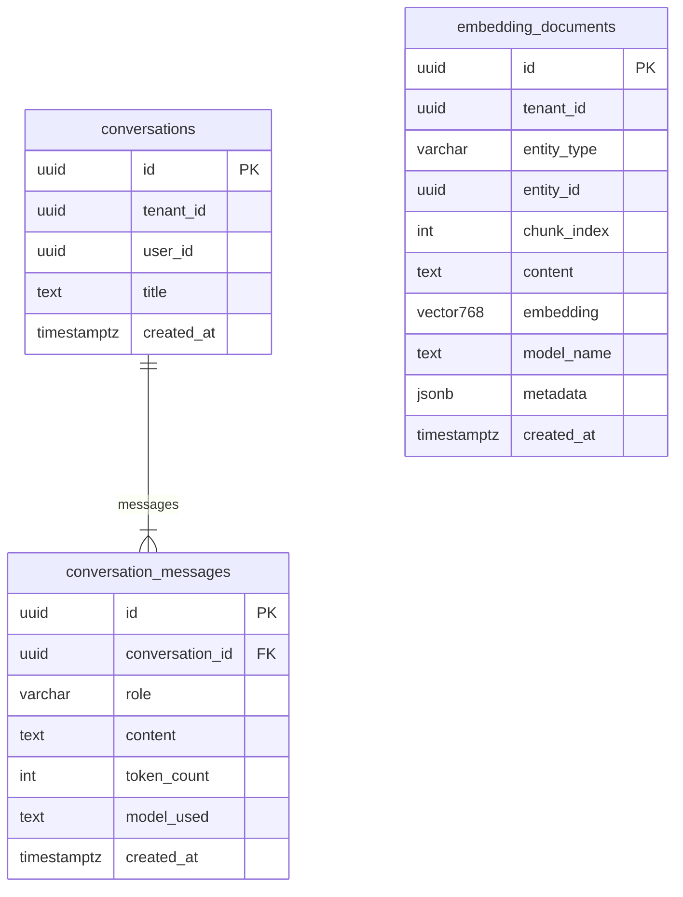
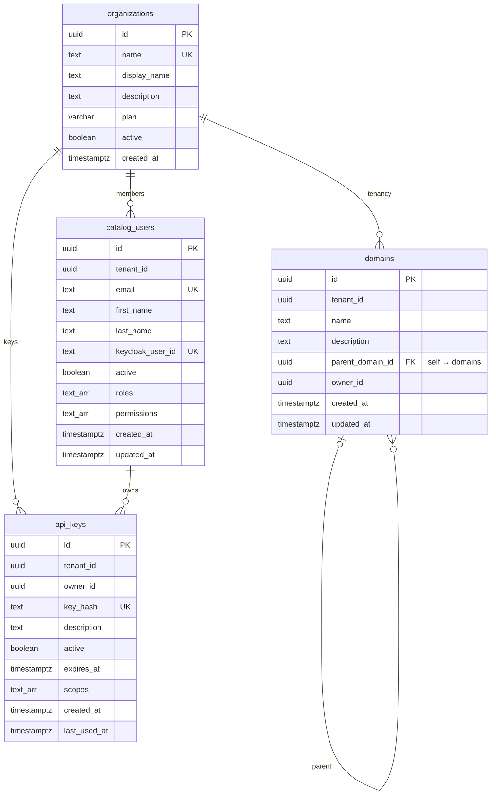

# ODIN Catalog — Database ERD

Five databases, one per service. All primary keys are `UUID`. Foreign keys reference PKs in the same database only; cross-service references use soft IDs stored as `UUID` columns without a database-level FK constraint.

---

## 1. inventory-service · PostgreSQL 16

Owns the DCAT / DPROD / CSV-W metadata model. `resources` is a polymorphic base table; every typed row (catalog, dataset, distribution, etc.) has a matching row there via a shared PK.

```mermaid
erDiagram
    resources {
        uuid        id              PK
        varchar     resource_type
        text        iri             UK
        uuid        tenant_id
        uuid        domain_id
        text        title
        text        description
        timestamptz issued
        timestamptz modified
        text_arr    language
        text_arr    keywords
        text_arr    themes
        text        license
        text        rights_statement
        text        access_rights
        text_arr    conforms_to
        uuid        creator_id
        uuid        publisher_id
        jsonb       contact_points
        text        source_uri
        jsonb       extra
        boolean     is_deleted
        timestamptz created_at
        timestamptz updated_at
    }

    catalogs {
        uuid     resource_id     PK  "FK → resources"
        text     homepage
        uuid_arr has_part
    }

    datasets {
        uuid        resource_id         PK  "FK → resources"
        uuid        catalog_id
        text        accrual_periodicity
        timestamptz temporal_start
        timestamptz temporal_end
        float       spatial_resolution_m
        text        temporal_resolution
        text        version
        text        version_notes
        uuid        is_version_of       FK  "self → datasets"
    }

    distributions {
        uuid    resource_id         PK  "FK → resources"
        uuid    dataset_id          FK
        text    access_url
        text    download_url
        text    media_type
        text    format
        bigint  byte_size
        varchar checksum_algorithm
        text    checksum_value
        text    compress_format
        text    package_format
        text    availability
        uuid    csvw_table_id       FK  "deferred"
    }

    data_services {
        uuid     resource_id          PK  "FK → resources"
        text     endpoint_url
        text     endpoint_description
        uuid_arr serves_dataset
        text     protocol
        text     security_schema_type
    }

    data_products {
        uuid    resource_id             PK  "FK → resources"
        varchar lifecycle_status
        uuid    owner_id
        text    purpose
        varchar information_sensitivity
        jsonb   has_policy
    }

    data_product_ports {
        uuid        id              PK
        uuid        data_product_id FK
        varchar     port_type
        uuid        data_service_id FK
        uuid        dataset_id      FK
        uuid        distribution_id FK
        timestamptz created_at
    }

    catalog_records {
        uuid        resource_id       PK  "FK → resources"
        uuid        catalog_id
        uuid        primary_topic_id
        timestamptz listing_date
        timestamptz modification_date
        text        harvest_source
    }

    csvw_tables {
        uuid        id              PK
        uuid        distribution_id FK
        text        url
        text        title
        text        description
        jsonb       dialect
        boolean     suppress_output
        text        table_direction
        text        notes
        timestamptz created_at
        timestamptz updated_at
    }

    csvw_table_schemas {
        uuid     id           PK
        uuid     table_id     FK
        text_arr primary_key
        text     about_url
        text     property_url
        text     value_url
    }

    csvw_columns {
        uuid    id                      PK
        uuid    schema_id               FK
        int     ordinal
        text    name
        text_arr titles
        text    datatype
        boolean required
        boolean virtual
        boolean suppress_output
        text    lang
        text    default_value
        text    property_url
        text    value_url
        text    about_url
        text    description
        uuid    logical_data_element_id FK  "nullable"
    }

    vocabularies {
        uuid        id              PK
        text        name
        text        prefix          UK
        text        base_iri        UK
        varchar     vocabulary_type
        text        description
        text        version
        text        homepage
        boolean     is_system
        timestamptz created_at
    }

    dataset_vocabulary_profiles {
        uuid        id            PK
        uuid        dataset_id    FK
        uuid        vocabulary_id FK
        boolean     is_primary
        text_arr    domain_tags
        timestamptz created_at
    }

    logical_models {
        uuid        id          PK
        uuid        dataset_id  FK
        text        name
        text        description
        text        version
        varchar     status
        timestamptz created_at
        timestamptz updated_at
    }

    logical_data_elements {
        uuid        id               PK
        uuid        logical_model_id FK
        text        name
        text        label
        text        description
        text        logical_type
        boolean     is_required
        boolean     is_identifier
        boolean     is_nullable
        int         ordinal
        timestamptz created_at
        timestamptz updated_at
    }

    logical_element_vocab_mappings {
        uuid        id                 PK
        uuid        logical_element_id FK
        uuid        vocabulary_id      FK
        text        concept_iri
        text        concept_label
        text        concept_definition
        varchar     match_type
        timestamptz created_at
    }

    cross_model_mappings {
        uuid        id           PK
        varchar     source_type
        uuid        source_id
        varchar     target_type
        uuid        target_id
        text        mapping_type
        timestamptz created_at
    }

    resources      ||--o|  catalogs                     : "extends"
    resources      ||--o|  datasets                     : "extends"
    resources      ||--o|  distributions                : "extends"
    resources      ||--o|  data_services                : "extends"
    resources      ||--o|  data_products                : "extends"
    resources      ||--o|  catalog_records              : "extends"

    datasets       ||--o{  distributions                : "has"
    datasets       o|--o|  datasets                     : "isVersionOf"
    datasets       ||--o{  dataset_vocabulary_profiles  : "profiles"
    datasets       ||--o{  logical_models               : "models"

    distributions  o|--o|  csvw_tables                  : "describes"

    csvw_tables    ||--o{  csvw_table_schemas            : "schema"
    csvw_table_schemas ||--|{ csvw_columns              : "columns"

    data_products  ||--o{  data_product_ports            : "ports"
    data_product_ports o{--o| data_services             : "via"
    data_product_ports o{--o| datasets                  : "via"
    data_product_ports o{--o| distributions             : "via"

    vocabularies   ||--o{  dataset_vocabulary_profiles   : "used in"
    vocabularies   ||--o{  logical_element_vocab_mappings : "mapped by"

    logical_models ||--|{  logical_data_elements         : "elements"

    logical_data_elements ||--o{ csvw_columns           : "bound by"
    logical_data_elements ||--o{ logical_element_vocab_mappings : "mappings"
```

---

## 2. harvest-service · PostgreSQL 16

Tracks harvest sources, scheduled jobs, run history, and per-entity results.

---

## 3. lineage-service · PostgreSQL 16 + Apache AGE

Relational tables persist OpenLineage events and column-level lineage. Apache AGE mirrors the same relationships as a Cypher-queryable property graph for multi-hop traversal.

```mermaid
erDiagram
    lineage_jobs {
        uuid    id            PK
        text    namespace
        text    name
        jsonb   facets
        bigint  age_vertex_id
    }

    lineage_datasets {
        uuid    id                  PK
        text    namespace
        text    name
        jsonb   facets
        jsonb   schema_facet
        uuid    catalog_resource_id
        bigint  age_vertex_id
    }

    lineage_runs {
        uuid        id                 PK
        text        run_id             UK
        uuid        job_id             FK
        jsonb       facets
        timestamptz nominal_start_time
        timestamptz nominal_end_time
    }

    lineage_run_events {
        uuid        id          PK
        uuid        run_id      FK
        varchar     event_type
        timestamptz event_time
        text        producer
        text        schema_url
        jsonb       inputs
        jsonb       outputs
        jsonb       raw_event
        timestamptz created_at
    }

    column_lineage {
        uuid    id                  PK
        uuid    run_event_id        FK
        uuid    output_dataset_id   FK
        text    output_column
        uuid    input_dataset_id    FK
        text    input_column
        text    transformation_type
    }

    lineage_jobs       ||--o{  lineage_runs        : "runs"
    lineage_runs       ||--o{  lineage_run_events  : "events"
    lineage_run_events ||--o{  column_lineage      : "columns"
    column_lineage     o{--o|  lineage_datasets    : "output dataset"
    column_lineage     o{--o|  lineage_datasets    : "input dataset"
```

> **Apache AGE graph** (`lineage_graph`):
> - Vertices: `Job {namespace, name}`, `Dataset {namespace, name}`, `Column {dataset, name}`
> - Edges: `READ_BY` (Dataset→Job), `WRITES_TO` (Job→Dataset), `DERIVED_FROM` (Dataset→Dataset), `COLUMN_LINEAGE` (Column→Column)
> - `lineage_jobs.age_vertex_id` and `lineage_datasets.age_vertex_id` link relational rows to their AGE vertex IDs.

---

## 4. ai-service · PostgreSQL 16 + pgvector

Stores chat conversations and the vector embedding corpus used for RAG.

> **pgvector index**: `embedding_documents.embedding` uses an `IVFFlat` index with cosine distance (`vector_cosine_ops`, 100 lists) for k-NN similarity search.
> The `(entity_id, chunk_index, model_name)` composite key ensures idempotent upserts on re-embedding.

---

## 5. identity-service · PostgreSQL 16

Manages organizations (tenants), domain hierarchy, users, and API keys. Keycloak is the authoritative identity provider; `catalog_users` mirrors relevant attributes and holds ABAC roles/permissions.

